# Vamos gerar o arquivo README.md com o conteúdo fornecido

readme_content = """
# Projeto: Engenharia de Dados e Garantia de Qualidade no Conjunto de Dados do Airbnb no Rio de Janeiro

## Introdução

O projeto utiliza o conjunto de dados "Inside Airbnb", disponível no website [Inside Airbnb](http://insideairbnb.com/), que oferece informações sobre listagens de hospedagem, avaliações de hóspedes e disponibilidade de calendário em várias cidades, incluindo o Rio de Janeiro.

### Componentes Principais do Conjunto de Dados:
1. **Listagem (Listing)**: Informações detalhadas sobre as propriedades, incluindo tipo, preço, localização, número de quartos, comodidades, entre outros.
2. **Avaliações (Reviews)**: Informações sobre as avaliações dos hóspedes, incluindo data, identificador da propriedade e comentários.
3. **Calendário (Calendar)**: Informações sobre a disponibilidade das propriedades e os preços ao longo do tempo.

O dicionário de dados está disponível no [site oficial](http://insideairbnb.com/).

## Objetivo do Projeto
Este projeto tem como objetivo aplicar conceitos de engenharia de dados e garantir a qualidade dos dados, utilizando diversas ferramentas e técnicas. As principais etapas incluem a aquisição, limpeza, transformação e monitoramento da qualidade dos dados, utilizando o banco de dados PostgreSQL e ferramentas como dbt e Great Expectations.

## Passos do Projeto

### 1. Aquisição de Dados e Armazenamento - Camada Bronze
- **Fonte**: Baixar os dados do Airbnb do Rio de Janeiro da fonte oficial ([Inside Airbnb](http://insideairbnb.com/)).
- **Estruturação**: Realizar uma organização simples dos dados.
- **Banco de Dados**: Criar um banco de dados PostgreSQL para armazenar os dados brutos das 3 tabelas principais ("Listing", "Reviews" e "Calendar") na camada "bronze".

### 2. Data Clean - Camada Silver
- **Tratamento de Dados**: Identificar e tratar valores ausentes, duplicatas e outliers nos dados da camada "bronze".
- **Padronização**: Ajustar e padronizar os nomes das colunas para um formato consistente.
- **Limpeza Textual**: Realizar limpeza em campos textuais, removendo caracteres especiais e corrigindo erros de digitação.

### 3. Garantia de Qualidade dos Dados - Camada Silver
- **Métricas de Qualidade**: Definir métricas de qualidade, como integridade, precisão e consistência dos dados.
- **Verificações de Qualidade**: Implementar verificações para garantir a conformidade dos dados com as métricas estabelecidas.
- **Monitoramento**: Estabelecer um sistema de monitoramento contínuo da qualidade dos dados.

### 4. Testes de Qualidade - Camada Silver
- **Great Expectations**: Utilizar a biblioteca Great Expectations para criar testes de qualidade automatizados.
- **Testes de Regras de Negócios**: Assegurar que os dados atendam às regras de negócios e aos requisitos de qualidade.

### 5. Transformação de Dados com dbt - Camada Silver
- **dbt**: Usar a ferramenta dbt para realizar transformações e criar a camada "silver".
- **Controle de Versão**: Manter o controle de versão dos modelos dbt e automatizar as execuções das transformações.

### 6. Armazenamento de Dados em PostgreSQL - Camada Silver
- **Banco de Dados**: Armazenar os dados transformados da camada "silver" no PostgreSQL.
- **Integração dbt-PostgreSQL**: Estabelecer conexões para carregar os dados da camada "silver".

### 7. Validação de Expectativas com Great Expectations - Camada Silver
- **Validações Adicionais**: Realizar validações adicionais para garantir a qualidade após cada transformação.
- **Ajustes de Testes**: Ajustar os testes de qualidade conforme necessário após as transformações.

### 8. Transformação de Dados com dbt - Camada Gold
- **dbt**: Utilizar o dbt para criar a camada "gold", aplicando agregações e cálculos especializados, como médias de preços por propriedade e por período.
- **Controle de Versão**: Manter controle de versão dos modelos dbt e automatizar as transformações.
- **Banco de Dados**: Armazenar os dados da camada "gold" no PostgreSQL, otimizados para consultas analíticas.

### 9. Apresentação e Discussão
- **Apresentação**: Expor os resultados e as principais etapas do projeto, destacando a engenharia de dados, a qualidade dos dados e o uso de ferramentas como dbt, Great Expectations e PostgreSQL.

## Ferramentas Utilizadas
- **PostgreSQL**: Banco de dados para armazenar as camadas de dados (bronze, silver, gold).
- **dbt (Data Build Tool)**: Para transformação e modelagem de dados nas camadas "silver" e "gold".
- **Great Expectations**: Para validação e monitoramento contínuo da qualidade dos dados.

## Table Structure

### Listings Table

| Name                            | Type          | Settings                         | References               | Note                         |
|---------------------------------|---------------|----------------------------------|---------------------------|------------------------------|
| **id**                          | INTEGER       | 🔑 PK, Not Null, Unique          |                           | Identificador único da listagem |
| **listing_url**                 | VARCHAR(255)  | Not Null                         |                           | URL da listagem no site    |
| **scrape_id**                   | INTEGER       | Not Null                         |                           | ID de scrape para rastreamento |
| **last_scraped**                | DATE          | Not Null                         |                           | Data da última coleta      |
| **source**                      | VARCHAR(50)   | Not Null                         |                           | Fonte de origem da listagem |
| **name**                        | VARCHAR(100)  | Not Null                         |                           | Nome da listagem           |
| **description**                 | TEXT          | Not Null                         |                           | Descrição da listagem      |
| **neighborhood_overview**       | TEXT          |                                  |                           | Visão geral do bairro      |
| **picture_url**                 | VARCHAR(255)  | Not Null                         |                           | URL da imagem principal    |
| **host_id**                     | INTEGER       | Not Null                         |                           | Identificador do anfitrião |
| **host_url**                    | VARCHAR(255)  | Not Null                         |                           | URL do perfil do anfitrião |
| **host_name**                   | VARCHAR(255)  | Not Null                         |                           | Nome do anfitrião          |
| **host_since**                  | DATE          |                                  |                           | Data de cadastro do anfitrião |
| **host_location**               | VARCHAR(255)  |                                  |                           | Localização do anfitrião   |
| **host_about**                  | TEXT          |                                  |                           | Sobre o anfitrião          |
| **host_response_time**          | VARCHAR(50)   |                                  |                           | Tempo de resposta do anfitrião |
| **host_response_rate**          | VARCHAR(10)   |                                  |                           | Taxa de resposta           |
| **host_acceptance_rate**        | VARCHAR(10)   |                                  |                           | Taxa de aceitação          |
| **host_is_superhost**           | BOOLEAN       |                                  |                           | Indicador de superhost     |
| **host_thumbnail_url**          | VARCHAR(255)  |                                  |                           | URL da miniatura do anfitrião |
| **latitude**                    | FLOAT         | Not Null                         |                           | Latitude da propriedade    |
| **longitude**                   | FLOAT         | Not Null                         |                           | Longitude da propriedade   |
| **property_type**               | VARCHAR(50)   | Not Null                         |                           | Tipo de propriedade        |
| **room_type**                   | VARCHAR(50)   | Not Null                         |                           | Tipo de quarto             |
| **accommodates**                | INTEGER       | Not Null                         |                           | Número de hóspedes suportados |
| **bathrooms**                   | FLOAT         |                                  |                           | Quantidade de banheiros    |
| **price**                       | FLOAT         | Not Null                         |                           | Preço por noite            |
| **availability_365**            | INTEGER       |                                  |                           | Dias disponíveis no ano    |
| **review_scores_rating**        | FLOAT         |                                  |                           | Nota de avaliação média    |
| **reviews_per_month**           | FLOAT         |                                  |                           | Avaliações por mês         |

Outros campos podem ser adicionados de forma semelhante, detalhando as informações pertinentes da listagem.

### Calendar Table

| Name             | Type          | Settings                   | References             | Note                           |
|------------------|---------------|----------------------------|-------------------------|--------------------------------|
| **listing_id**   | INTEGER       | 🔑 PK, Not Null, Unique    | listings(id)            | Relacionamento com a tabela `listings` |
| **date**         | DATE          | Not Null                   |                         | Data específica no calendário |
| **available**    | BOOLEAN       | Not Null                   |                         | Indica se está disponível     |
| **price**        | FLOAT         |                            |                         | Preço na data específica      |
| **adjusted_price** | FLOAT       |                            |                         | Preço ajustado para a data    |

### Reviews Table

| Name              | Type          | Settings                      | References              | Note                           |
|-------------------|---------------|-------------------------------|--------------------------|--------------------------------|
| **listing_id**    | INTEGER       | 🔑 PK, Not Null, Unique       | listings(id)             | Relacionamento com a tabela `listings` |
| **id**            | INTEGER       | Not Null                      |                          | Identificador da avaliação     |
| **date**          | DATE          | Not Null                      |                          | Data da avaliação              |
| **reviewer_id**   | INTEGER       | Not Null                      |                          | ID do avaliador               |
| **reviewer_name** | VARCHAR(255)  | Not Null                      |                          | Nome do avaliador             |
| **comments**      | TEXT          |                               |                          | Comentários da avaliação      |

---

## Relationships

- **listings to calendar**: Um `listing` pode ter múltiplos `calendar` associados (relação de um-para-muitos).
- **listings to reviews**: Um `listing` pode ter múltiplas `reviews` associadas (relação de um-para-muitos).

---

## Database Diagram

```mermaid
erDiagram
	listings }o--|| calendar : references
	listings }o--|| reviews : references

	listings {
		INTEGER id
		VARCHAR(255) listing_url
		INTEGER scrape_id
		DATE last_scraped
		VARCHAR(50) source
		VARCHAR(100) name
		TEXT description
		TEXT neighborhood_overview
		VARCHAR(255) picture_url
		INTEGER host_id
		VARCHAR(255) host_url
		VARCHAR(255) host_name
		DATE host_since
		VARCHAR(255) host_location
		TEXT host_about
		VARCHAR(50) host_response_time
		VARCHAR(10) host_response_rate
		VARCHAR(10) host_acceptance_rate
		BOOLEAN host_is_superhost
		VARCHAR(255) host_thumbnail_url
		VARCHAR(255) host_picture_url
		VARCHAR(100) host_neighbourhood
		INTEGER host_listings_count
		INTEGER host_total_listings_count
		TEXT host_verifications
		BOOLEAN host_has_profile_pic
		BOOLEAN host_identity_verified
		VARCHAR(100) neighbourhood
		VARCHAR(100) neighbourhood_cleansed
		VARCHAR(100) neighbourhood_group_cleansed
		FLOAT latitude
		FLOAT longitude
		VARCHAR(50) property_type
		VARCHAR(50) room_type
		INTEGER accommodates
		FLOAT bathrooms
		VARCHAR(50) bathrooms_text
		INTEGER bedrooms
		INTEGER beds
		TEXT amenities
		FLOAT price
		INTEGER minimum_nights
		INTEGER maximum_nights
		INTEGER minimum_minimum_nights
		INTEGER maximum_minimum_nights
		INTEGER minimum_maximum_nights
		INTEGER maximum_maximum_nights
		FLOAT minimum_nights_avg_ntm
		FLOAT maximum_nights_avg_ntm
		VARCHAR(50) calendar_updated
		BOOLEAN has_availability
		INTEGER availability_30
		INTEGER availability_60
		INTEGER availability_90
		INTEGER availability_365
		DATE calendar_last_scraped
		INTEGER number_of_reviews
		INTEGER number_of_reviews_ltm
		INTEGER number_of_reviews_l30d
		DATE first_review
		DATE last_review
		FLOAT review_scores_rating
		FLOAT review_scores_accuracy
		FLOAT review_scores_cleanliness
		FLOAT review_scores_checkin
		FLOAT review_scores_communication
		FLOAT review_scores_location
		FLOAT review_scores_value
		VARCHAR(255) license
		BOOLEAN instant_bookable
		INTEGER calculated_host_listings_count
		INTEGER calculated_host_listings_count_entire_homes
		INTEGER calculated_host_listings_count_private_rooms
		INTEGER calculated_host_listings_count_shared_rooms
		FLOAT reviews_per_month
	}

	calendar {
		INTEGER listing_id
		DATE date
		BOOLEAN available
		FLOAT price
		FLOAT adjusted_price
		INTEGER minimum_nights
		INTEGER maximum_nights
	}

	reviews {
		INTEGER listing_id
		INTEGER id
		DATE date
		INTEGER reviewer_id
		VARCHAR(255) reviewer_name
		TEXT comments 
	}
```

---

Este projeto demonstra uma abordagem prática de engenharia de dados, garantindo a qualidade dos dados em cada etapa do pipeline e aplicando metodologias robustas para transformação e validação.
"""
